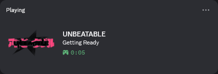
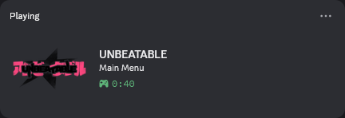
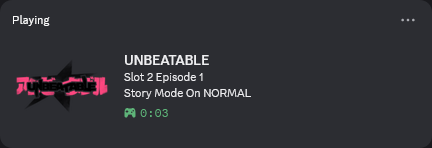
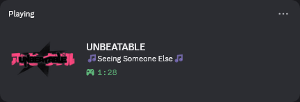
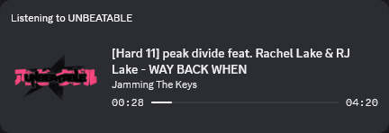
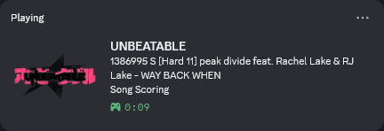

# UNBEATABLE Discord RPC

Add additional info to [UNBEATABLEs](https://store.steampowered.com/app/2240620/UNBEATABLE/) Discord RPC using [MelonLoader](https://github.com/LavaGang/MelonLoader).

## Installation

First, install [MelonLoader](https://github.com/LavaGang/MelonLoader). Since UNBEATABLE is a Steam game the installer should just work.

Afterwards run UNBEATABLE once and open the games files (in Steam right click UNBEATABLE and choose Properties > Installed Files > Browse).

Now download and copy the file "UNBEATABLE_Discord_RPC.dll" from the [latest release](https://github.com/phillitwithjuice/UNBEATABLE-Discord-RPC/releases/latest) into the "Mods" folder inside the game files.

Additionally this Melon requires https://github.com/Lachee/discord-rpc-csharp/ so download the `netstandard2.0-dll.zip` from https://github.com/Lachee/discord-rpc-csharp/releases/tag/v1.6.1 and extract the `DiscordRPC.dll` file into the `UserLibs` folder inside the game files.

### Help! Please get rid of that console window/the stuttering when ALT+Tabbing

Add the following to your launch options (in Steam right click UNBEATABLE and edit Properties > General > Launch Options).

```
--melonloader.hideconsole
```

## Features

 - Startup status (during logo and title screen)
   
   

 - Main menu status

   

 - Story mode status

   
   
 - Arcade mode menu status (every screen has a different status)

   

 - Arcade playing status

   

 - Arcade scoring status

   

